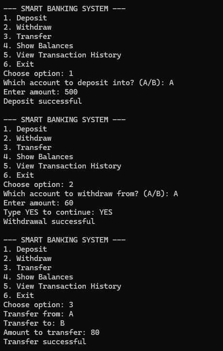
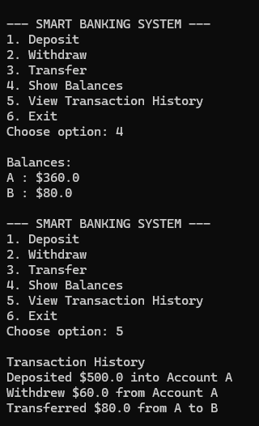

# Smart Banking Assistant
A beginner Python project created while learning programming fundamentals. The application simulates basic banking operations such as deposits, withdrawals, transfers, and transaction tracking.
## Overview
* This project was developed as part of my self-learning journey in Python.
* The goal was to apply fundamental programming concepts to a simple banking simulation. Through building this project, I practised breaking down problems into smaller functions, handling user input, validating data, and storing transaction records.
* While the program is relatively simple, it provided valuable hands-on experience with writing structured code and implementing logical workflows.
## Features
### Account Balance Management
* View balances for multiple accounts
### Deposits
* Deposit funds into selected accounts
* Validation of invalid amounts
### Withdrawals
* Withdraw funds from accounts
* Prevent withdrawals exceeding available balance
* Transaction confirmation step
### Transfers
* Transfer money between accounts
* Validation checks for account selection and balances
### Transaction History
* Record transactions during program execution
* Save transaction records to a text file
### Basic Fraud Detection
* Display warnings for unusually large withdrawals or transfers
## Screenshot

## Programming Concepts Practised
* Variables
* Functions
* Dictionaries
* Lists
* Conditional statements
* Loops
* Input validation
* File handling
* Program flow control
## What I Learned
* Organise a program into reusable functions
* Store and retrieve information using dictionaries
* Validate user inputs
* Design logical workflows for user interactions
This project helped me gain confidence in applying Python concepts outside of tutorials and exercises.
## Future Improvements
* User login system
* Password protection
* Account creation
* Data persistence using a database
* Graphical user interface (GUI)
